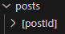

# Curso NextJs Fazt

## App router

Sistema de enrutamiento mediante carpetas, cada carpeta que esté dentro del app router será una ruta.

### page.jsx

Archivo que será detectado como la web de ese path (directorio)

### layout.jsx

Archivo que servirá de plantilla para los page.jsx.

### Anidamiento

Las carpetas que están dentro de otra servirán cmo rutas anidadas --> `/category/product`, Los layouts también heredaras los elementos que contenga un layout de orden superior.

### Link

Elemento para la navegación, que reemplza a `<a>`, ua que evita que la página reinicie. 

```jsx
Import Link from 'next/link'
<Link href='/'>Home</Link>
```

### Metadatos

Sirve para definir etiquetas del head, por medio de clave y valor. Se puede usar en cualquier page o layout

```jsx
// layout.jsx
export const metadata = {
  title: 'page name',
  // Etiquetas meta
  description: 'Description of my site'
} 
```

## Fonts

Se puede importar fuentes directamente desde sgoogle fonts

```jsx
import { Roboto } from 'next/font/google'

const roboto = Roboto ({
  weight: ['300', '400']
  styles: ['italic', 'normal']
})

<body className={roboto.className}></body>

```

## Error 404

NextJS tiene una página por defecto para el error not found.

### Crear página not found personalizada

`app/not-found.jsx`--> Lo que se agregue en esa página, será renderizado, cuando se presente el error not found

## React Server Components

NextJS es un framework que tiene características de frontend y backend.

### Server components

Componentes que no necesitan interactividad, son los que se crean por defecto en NextJS. 

El console.log() se ve en la terminal del servidor no en el navegador.

### Client Components

Son los que requieren interactividad, se utiliza la instrucción `"use client"`.

Si el componente cliente carga otro componente, este no necesita la instrucción para funcionar con interactividad.

Metadata solo funciona en los componentes de servidor.

## Fetch

Se realiza en los Server Components

El fectch en React sin Next requiere --> usestate, useEffect.

En Next JS al ejecutarse desde el servidor no requiere utilizar ningún hook

## Loading page

Páginas especial se nombra page.jsx --> En este componente se renderizará lo que se desee mientras la página carga.

```js
// Esto simulará que los datos se demoran 3 segundos en llegar
await new Promise((resolve) => setTimeout(resolve, 3000))
```

- Tip --> Cargar la página sin el caché, click derecho en el ícono de recargar --> vaciar caché forzado

## Params

Una página donámica, es decir que hará uso de los query params se declara con `[]` ,ejemplo `/user/[id]`



### Acceder a las query params

Se accede a través de las prop {params}

## Suspense

Componente de react --> `import { Suspense } from 'react'`. Similar a loading, pero es para componentes cargados dentro de una aplicación, se utiliza con la prop `fallback={elm}`. Esto hace posible que partes de la web carguen de forma independiente.

No requiere useclient.

```js
<Suspense
  fallback={
    <div>Cargando publicaciones ...</div>
  }>
  <Posts />
</Suspense>
```
<!-- Reapasar y comprobar esta funcionalidad -->

## Import alias

Utilidad de nextjs para cargar componentes, reemplazando los niveles por un símbolo --> ejemplo `../../` por `@`

```js
import PostCard from '../components/post_card'
import PostCard from '@/components/post_card'
```
El @ representaría al root

## css

### css global

Se importa el archivo css desde un layout

### css local (component, page)

Se crea un css dentro de la misma carpeta del componente o page, se importa y se definen las clases que se utilizarán.

### Añadir tailwind

```
npm install -D tailwindcss postcss autoprefixer
npx tailwindcss init -p
```

```js
//tailwind.config.js

/** @type {import('tailwindcss').Config} */
module.exports = {
  content: [
    "./app/**/*.{js,ts,jsx,tsx,mdx}",
    "./pages/**/*.{js,ts,jsx,tsx,mdx}",
    "./components/**/*.{js,ts,jsx,tsx,mdx}",
 
    // Or if using `src` directory:
    "./src/**/*.{js,ts,jsx,tsx,mdx}",
  ],
  theme: {
    extend: {},
  },
  plugins: [],
}

```css
/* globals.css */
@tailwind base;
@tailwind components;
@tailwind utilities;
```

'[Continúa en crear proyecto nextjs'](https://youtu.be/_SPoSMmN3ZU?t=6078)